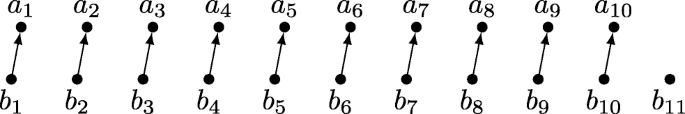
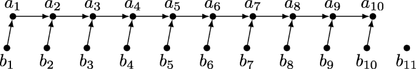

https://link.springer.com/article/10.1007/s00224-020-09987-4#:~:text=MergeInsertion%2C%20also%20known%20as%20the,the%20information%2Dtheoretic%20lower%20bound.

https://iq.opengenus.org/merge-insertion-sort/

[Recursive insertion sort] (https://www.geeksforgeeks.org/recursive-insertion-sort/)

Ordre:

### 1. Comparaison par paires

Itérer la liste initiale par paire de deux éléments.
Envoyé la plus grande valeur dans une sous-liste `highest` (`a`)
et la plus petite valeur, dans une sous-liste `smallest` (`b`).


p.ex. :
```c++
initial list:     9 8 1 5 4 7 3 4

pairs comparison: [9 8] [1 5] [4 7] [3 4]
highest:          9      5     7     4
smallest:         8      1     4     3  
```

### 2. Trier récursivement la sous-liste `highest`

p.ex. :
```c++
initial list:     9 8 1 5 4 7 3 4

highest sorted:   4 5 7 9
smallest:         8 1 4 3  
```

### 3. Réorganise la chaîne `smallest` pour que chaque élément de
`smallest` soit plus petit que l'élément correspondant de `highest`.



Il faut préserver la logique: a<sub>i</sub> < a<sub>i + 1</sub> and a<sub>i</sub> > b<sub>i</sub>

p.ex. :
ici 8 n'est pas plus petit que 4, alors il faut réorganiser `smallest`
```c++
initial list:     9 8 1 5 4 7 3 4

highest sorted:   4 5 7 9
smallest:         8 1 4 3  
```

pour cette réorganisation, j'ai tout simplement trié la liste `smallest`